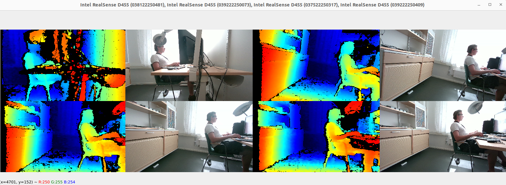

# librealsense_multicamera
This is a test project for 4 cameras D455

# Quick Start 

    python3 d455_4cam.py

to run plot RGB and DEPTH images in a window use **camera_mode = 0**, keep **N** as default

 __d455.run_loop(camera_mode=0, N = 10)

to exit from the window press **q** or **ESC**. 

to save RGB and DEPTH in separated AVI use **camera_mode = 1** and specify the number of frames to capture **N=100**

    __d455.run_loop(camera_mode=1, N = XXXX) 

**N** is a number of frames. It will save in save **folder**

to save RGB and DEPTH in separated frames  **camera_mode = 2** and specify the number of frames to capture **N=100**
